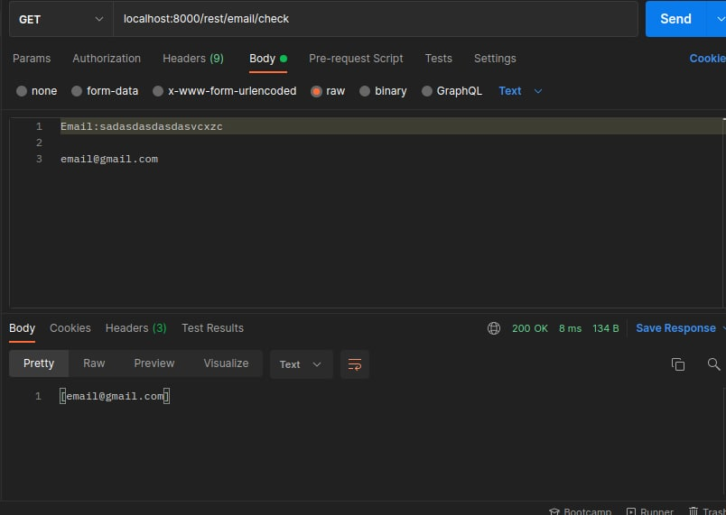
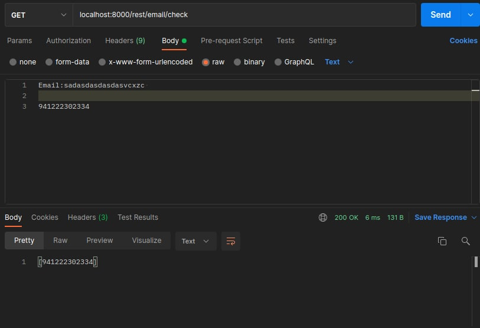
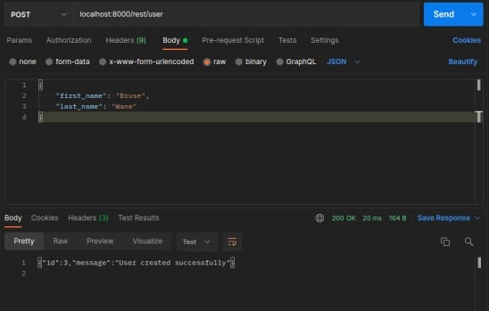
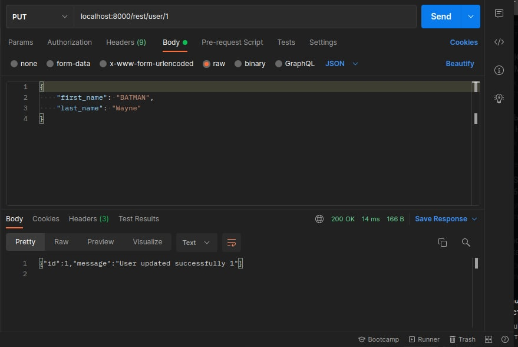
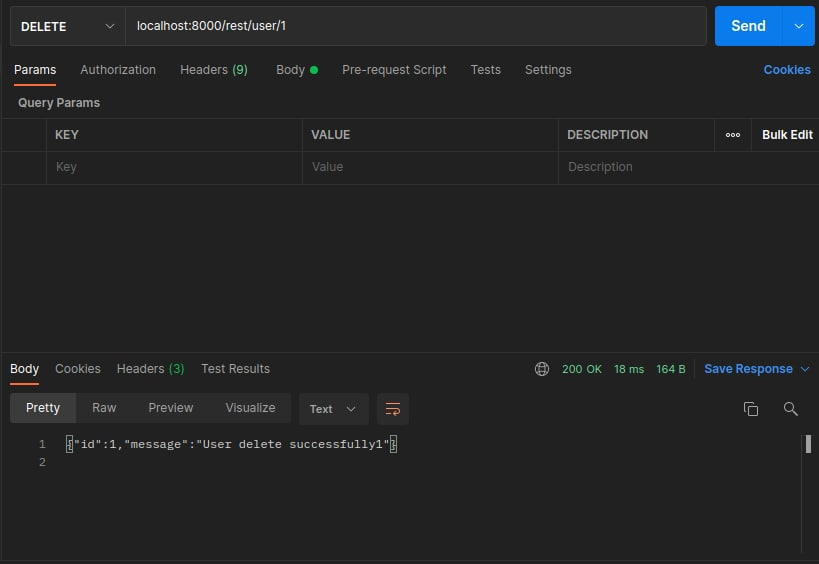

# Rest-api

```
docker-compose up -d --build
```

* `GET` : /rest/email/check



##### ИИН



##### PostgreSQL Table
```
CREATE TABLE users (
    id SERIAL PRIMARY KEY,
    first_name varchar(255) NOT NULL,
    last_name varchar(255) NOT NULL
);
```

###### Postgre routes

###### create user

* `POST` : /rest/user



###### Get user
* `GET` : /rest/user/{id}

###### Update user
* `PUT` : /rest/user/{id}



###### Delete user
* `DELETE` : /rest/user/{id}


